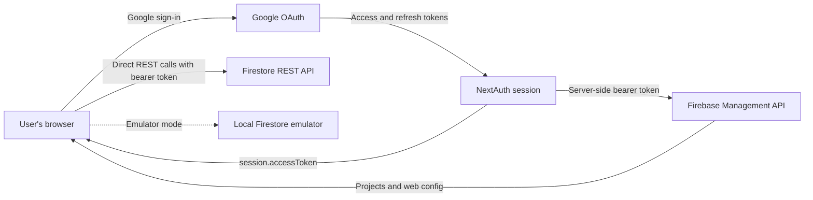

# Fluxfire

Fluxfire is a lightweight Firebase administration panel built with Next.js. It lets a user sign in with Google, choose a Firebase project they already have access to, and browse or modify that project's Firestore data using the user's Google Cloud IAM permissions.

Fluxfire does not have an application database and does not ask for a Firebase service-account key. Google OAuth provides the user's access token, the Firebase Management API supplies project metadata, and the Firestore REST API is the data plane.

> [!WARNING]
> Fluxfire can write to and delete production Firestore data. The emulator switch is off by default. Always confirm the environment shown in the sidebar before making changes.

## Contents

- [What is implemented](#what-is-implemented)
- [How it works](#how-it-works)
- [Authentication and authorization](#authentication-and-authorization)
- [Technology stack](#technology-stack)
- [Prerequisites](#prerequisites)
- [Google Cloud and OAuth setup](#google-cloud-and-oauth-setup)
- [Local setup](#local-setup)
- [Environment variables](#environment-variables)
- [Available commands](#available-commands)
- [Using Fluxfire](#using-fluxfire)
- [Routes and API endpoints](#routes-and-api-endpoints)
- [Firestore implementation](#firestore-implementation)
- [State and caching](#state-and-caching)
- [Firebase Emulator Suite](#firebase-emulator-suite)
- [Security model](#security-model)
- [Deployment](#deployment)
- [Development conventions](#development-conventions)
- [Troubleshooting](#troubleshooting)
- [Known limitations](#known-limitations)
- [Project structure](#project-structure)

## What is implemented

### Project access

- Google sign-in through NextAuth/Auth.js.
- Automatic OAuth access-token refresh using the Google refresh token.
- Listing of the signed-in user's active Firebase projects.
- Project search and selection.
- Resolution of the first registered Firebase web app's configuration.
- Locally persisted project selection and emulator preferences.
- Fresh project-access validation before the dashboard renders, on window
  focus, every 60 seconds, and after production Firestore permission errors.
- Automatic disconnection and project-cache removal when access is revoked.

### Firestore browser

- Three-panel collection tree, document table, and document inspector.
- Multiple Firestore workspace tabs with independent navigation, queries, pagination, selection, and open-document state.
- Nested collections and subcollections.
- URL-addressable navigation through `?path=...`.
- Collection-group mode through `?cg=1`.
- Document creation, field editing, field renaming, and deletion.
- Raw JSON inspection.
- Support for Firestore strings, integers, doubles, booleans, nulls, timestamps, geographic points, document references, arrays, maps, and bytes.
- Filter queries using comparison, membership, array, null, and NaN operators.
- Searchable filter and order field pickers populated from loaded documents, with support for custom and nested field paths.
- Multiple `orderBy` clauses and configurable query limits.
- Stable collection pagination with a default page size of 50.
- Bulk document deletion in batches of up to 500 writes.
- JSON and CSV export of selected documents.
- Helpful permission errors and direct links to create missing composite indexes.
- Direct connection to the local Firestore emulator.

### Query workbench

- Standalone visual query builder at `/query`.
- Root-collection and nested subcollection path targeting.
- Collection-group queries, typed filters, multiple order clauses, and limits.
- Generated Firestore REST `structuredQuery` request preview with copy action.
- Query result table with selection, document ID copying, and JSON/CSV export.
- Editable document inspector opened directly from query results.
- Explicit reruns of identical queries and automatic result refresh after writes.
- Permission guidance and direct composite-index creation links.

### Not yet implemented

- The **Authentication** page is a placeholder; it does not manage Firebase Auth users yet.

### Appearance

- Light, dark, and system themes are available from Settings.
- The selected preference is stored in browser `localStorage` under `fluxfire-theme`.
- System mode follows the operating-system color-scheme preference and responds to changes automatically.

## How it works



The application has two API access patterns:

1. **Firebase project metadata is fetched server-side.** Route handlers call `auth()`, read `session.accessToken`, and forward it to the Firebase Management API.
2. **Firestore data is fetched client-side.** The browser reads the same access token from `useSession()` and calls `firestore.googleapis.com` directly.

The second pattern is intentional. The Firebase JavaScript SDK normally authenticates as a Firebase Auth user and evaluates Firestore Security Rules. Fluxfire is an administrative tool, so it uses the signed-in Google identity and lets Google Cloud IAM decide which operations are allowed.

A persisted project is treated only as a preference, not proof of access. The
dashboard remains hidden until `/api/projects/:projectId/access` confirms the
current Google identity can still retrieve that Firebase project. Access checks
and their upstream Firebase Management requests explicitly disable caching.

## Authentication and authorization

Fluxfire uses NextAuth v5 with Google as its only provider. The provider requests these scopes in `lib/auth.ts`:

```text
openid
email
profile
https://www.googleapis.com/auth/firebase
https://www.googleapis.com/auth/datastore
https://www.googleapis.com/auth/cloud-platform.read-only
```

During initial sign-in, NextAuth stores the Google access token, refresh token, and expiry time in its encrypted JWT session. When the access token expires, the JWT callback posts the refresh token and this application's Google OAuth credentials to Google's token endpoint. The session callback then exposes the current access token as `session.accessToken` to server and client code.

OAuth scopes define what the token may request; they do not grant access to a project by themselves. The user must also have suitable Google Cloud IAM permissions on each Firebase project. A user will only see or modify resources permitted by their assigned roles.

When scopes change, existing sessions do not automatically gain them. Users must sign out and grant consent again.

## Technology stack

- Next.js 16 App Router
- React 19
- TypeScript with strict checking
- Tailwind CSS v4
- shadcn/ui, new-york style with a neutral base
- NextAuth/Auth.js v5
- TanStack Query v5
- Zustand v5 with local-storage persistence
- next-themes for persisted light, dark, and system appearance
- Sonner notifications
- Lucide icons
- Firebase Management API and Firestore REST API

The `firebase` npm package is currently installed but intentionally unused. Firestore operations use REST rather than the Firebase client SDK.

## Prerequisites

Before starting, install or obtain:

- A current Node.js release compatible with Next.js 16; Node.js 20 LTS or newer is recommended.
- npm.
- A Google Cloud project that will own the OAuth client.
- At least one Firebase project accessible to the Google account used for testing.
- A Firestore database initialized in that Firebase project if you want to use the data browser.

## Google Cloud and OAuth setup

### 1. Choose the OAuth owner project

In the [Google Cloud Console](https://console.cloud.google.com/), create or select the project that will own Fluxfire's OAuth consent screen and OAuth client. This may be separate from the Firebase projects users administer.

### 2. Enable APIs

Enable the APIs needed by the application:

- Firebase Management API
- Cloud Resource Manager API
- Cloud Firestore API

The target Firebase projects must also have Firebase and Firestore initialized as appropriate.

### 3. Configure the OAuth consent screen

Configure the application name, support contact, audience, and requested scopes. While the consent screen is in testing mode, add every Google account that should be able to sign in as a test user. External production applications may need to complete Google's verification process for sensitive scopes.

### 4. Create the OAuth client

Create an OAuth 2.0 Client ID with application type **Web application**. Add the callback URL for each environment under **Authorized redirect URIs**:

```text
http://localhost:3000/api/auth/callback/google
https://your-domain.example/api/auth/callback/google
```

The URI must match the scheme, host, port, path, and trailing-slash behavior used by the application. Copy the generated client ID and client secret into the corresponding deployment environment.

### 5. Assign user IAM access

Grant each user only the roles needed on the Firebase projects they should administer. Fluxfire does not bypass IAM and cannot elevate the signed-in user's privileges.

## Local setup

Clone the repository and install dependencies:

```bash
git clone <repository-url>
cd fluxfire-next
npm install
```

Create `.env.local` manually using the template below. This repository currently ignores all `.env*` files and does not include an environment example file.

Start the development server:

```bash
npm run dev
```

Open [http://localhost:3000](http://localhost:3000). The middleware redirects unauthenticated users to `/login` and authenticated users to `/projects`.

## Environment variables

Create `.env.local` in the repository root:

```dotenv
# Google OAuth web client
GOOGLE_CLIENT_ID=your-google-oauth-client-id
GOOGLE_CLIENT_SECRET=your-google-oauth-client-secret

# NextAuth/Auth.js session encryption
AUTH_SECRET=replace-with-a-long-random-secret

# Public base URL used to construct authentication callbacks
NEXTAUTH_URL=http://localhost:3000
```

| Variable | Required | Description |
| --- | --- | --- |
| `GOOGLE_CLIENT_ID` | Yes | OAuth web-client identifier from Google Cloud Console. |
| `GOOGLE_CLIENT_SECRET` | Yes | OAuth web-client secret. It is used on the server during sign-in and token refresh. |
| `AUTH_SECRET` | Yes | Secret used to sign and encrypt the Auth.js session. Use a strong, unique random value. |
| `NEXTAUTH_URL` | Yes | Canonical application base URL, such as `http://localhost:3000` or the production HTTPS URL. |

Some older NextAuth configurations call the session secret `NEXTAUTH_SECRET`. This project should use the v5 name, `AUTH_SECRET`.

Do not commit `.env.local` or expose the Google client secret in browser code. Environment files are ignored by Git by default.

After changing OAuth credentials, restart the development server, sign out, and sign in again. Also ensure that the callback URL derived from `NEXTAUTH_URL` is registered on the new OAuth client.

## Available commands

| Command | Purpose |
| --- | --- |
| `npm run dev` | Start the Next.js development server at `http://localhost:3000`. |
| `npm run build` | Create and type-check a production build. |
| `npm run start` | Serve the previously generated production build. |
| `npm run lint` | Run ESLint with the Next.js configuration. |

There is currently no automated test runner or Storybook configuration.

## Using Fluxfire

### Sign in and select a project

1. Visit `/login` and select **Sign in with Google**.
2. Review and grant the requested permissions.
3. Search the `/projects` page by Firebase display name or project ID.
4. Select a project. Fluxfire resolves the first registered web app's configuration, persists the selection, and opens `/firestore`.

If the project has no registered web app, the project-config endpoint returns a minimal configuration and a warning. Firestore REST access depends primarily on the project ID and OAuth token, so basic data operations can still be available.

### Browse and edit Firestore

- Use the left panel to expand collections, documents, and subcollections. Selecting a collection opens it in a new workspace tab by default; if the current tab is blank, Fluxfire reuses it.
- Use the **+** button above the data panels to open another workspace tab; switch or close tabs without losing the state of the remaining workspaces.
- Select a collection to load its first page of documents.
- Select a document to open its field editor, subcollections, and raw JSON in the right panel.
- Add, rename, change, or remove fields, then select **Save**.
- Create a document with **New document**.
- Delete a document from its inspector, or select multiple rows to use bulk actions.
- Export selected documents as JSON or flattened CSV.

Document paths are stored in the URL. For example:

```text
/firestore?path=users
/firestore?path=users/alice
/firestore?path=users/alice/orders
/firestore?path=orders&cg=1
```

When multiple workspaces are open, Fluxfire also adds a `tab` parameter. This associates browser history entries with the correct workspace so Back and Forward can reactivate it. Tab IDs and inactive workspace state are page-local and are not persisted after a full reload.

### Run structured queries

The embedded Firestore query builder and standalone Query workbench support:

- `==`, `!=`, `<`, `<=`, `>`, and `>=`
- `in` and `not-in`
- `array-contains` and `array-contains-any`
- `is-null`, `is-not-null`, `is-nan`, and `is-not-nan`
- Ascending and descending field ordering
- Result limits
- Collection-group queries

Firestore's normal query restrictions still apply. For example, the first order field may need to match the inequality field. Queries requiring a composite index return a **Create index** link when Google includes one in the error response.

## Routes and API endpoints

| Route | Type | Purpose |
| --- | --- | --- |
| `/` | Redirect | Sends signed-in users to `/projects` and other users to `/login`. |
| `/login` | Page | Google sign-in screen. |
| `/projects` | Page | Lists, searches, and selects Firebase projects. |
| `/firestore` | Page | Full Firestore browser and embedded query builder. |
| `/auth` | Page | Placeholder for Firebase Authentication management. |
| `/query` | Page | Standalone visual query workbench with request preview, results, exports, and document inspection. |
| `/settings` | Page | Emulator ports and appearance controls. |
| `/api/auth/[...nextauth]` | Route handler | NextAuth/Auth.js sign-in, callback, session, and sign-out endpoints. |
| `GET /api/projects` | Route handler | Lists active Firebase projects visible to the current Google identity. |
| `GET /api/projects/:projectId/access` | Route handler | Performs an uncached access check for the persisted project. A Firebase Management `403` or `404` becomes `{ accessible: false }`. |
| `GET /api/projects/:projectId/config` | Route handler | Lists web apps and returns the first web app's Firebase config. |

`middleware.ts` protects application pages. The project API handlers are excluded from middleware matching but authenticate independently by calling `auth()` and returning `401` when no access token is available.

Firestore document traffic does not pass through a Fluxfire API route.

## Firestore implementation

### REST endpoint

Production requests target the default database:

```text
https://firestore.googleapis.com/v1/projects/{projectId}/databases/(default)/documents
```

Each request includes:

```http
Authorization: Bearer <Google OAuth access token>
```

Only the `(default)` Firestore database is currently supported.

### Paths and navigation

`lib/firestore/paths.ts` centralizes path encoding and classification. A collection path has an odd number of segments, while a document path has an even number. Each segment is URL-encoded individually.

The Firestore page treats the URL as navigation state. Its `tab` parameter identifies the active workspace and `path` identifies that tab's collection or document. Open workspace panels remain mounted while inactive, preserving their filters, selection, pagination stack, open document, and failed-write markers. Navigating a particular tab to a different collection still remounts that tab's keyed `CollectionView` and resets only that collection-specific state.

### Values

`lib/firestore/encoding.ts` converts between Firestore's REST `Value` representation and the discriminated `FieldValue` union in `types/firestore.ts`.

Firestore integers are deliberately kept as decimal strings. Converting arbitrary Firestore integers to JavaScript numbers could truncate values outside JavaScript's 53-bit safe-integer range.

### Queries and pagination

`lib/firestore/queries.ts` translates local query state into a Firestore `structuredQuery` request. When the user has not specified an order, Fluxfire injects `__name__ ASCENDING` to make cursor behavior stable.

Normal collection browsing uses Firestore `pageToken` pagination. The page-token stack is changed only when the user selects Next or Previous. Structured-query results are not currently paginated in the UI.

### Writes and cache invalidation

Single-document mutations invalidate:

- The affected document cache entry.
- The parent collection browse entry.
- Active query entries for the project.

Bulk commits are split into chunks of 500 writes and invalidate the entire project's Firestore cache prefix when complete. Failed chunks are reported and failed document paths remain highlighted in the table.

## State and caching

### Zustand

`stores/project-store.ts` persists the following data to `localStorage` under `fluxfire-project`:

- Selected Firebase project metadata.
- Resolved Firebase web configuration.
- Emulator enabled/disabled state.
- Firestore emulator port, default `8080`.
- Auth emulator port, default `9099`.

Disconnecting clears project metadata but leaves emulator preferences intact. This persistence is browser-local and is not synchronized to a backend.

### TanStack Query

Project metadata and Firestore server state use TanStack Query. Global defaults are:

- Data remains fresh for 1 minute.
- Unused data is garbage-collected after 5 minutes.
- Queries retry once.
- Mutations do not retry automatically.
- Window focus does not trigger a refetch.

Every Firestore cache key begins with `['firestore', projectId, ...]`. Preserve that prefix when adding hooks so project-wide invalidation after writes continues to work.

The dashboard access guard uses a separate
`['firebase-project-access', projectId]` query. It always refetches on mount,
refetches on window focus, and polls every 60 seconds. A production Firestore
`403` invalidates this query immediately. If the dedicated access endpoint says
the project is no longer accessible, Fluxfire removes the project’s Firestore
and configuration queries, clears the Zustand selection, and redirects to the
project picker. Operation-specific `403` responses do not automatically eject a
user who still has valid, more limited access.

Disconnect and sign-out also clear the relevant in-memory query data. TanStack
Query data is not persisted to browser storage.

## Firebase Emulator Suite

Enable emulator mode from the sidebar or Settings. Firestore requests then use:

```text
http://localhost:{firestorePort}/v1/projects/{projectId}/databases/(default)/documents
```

The default Firestore port is `8080`. The default Auth emulator port is `9099`, but it is only stored for future Auth-page support and currently does not affect authentication traffic.

Important emulator behavior:

- The selected Firebase project ID is still included in emulator paths.
- Google sign-in still uses the configured OAuth client; emulator mode only redirects Firestore data calls.
- Ensure the emulator is running and allows requests from `http://localhost:3000`.
- The sidebar clearly labels the current connection as **Emulator** or **Production**.

## Security model

- The Google client secret and refresh-token exchange remain server-side.
- The Google access token is deliberately exposed in the authenticated NextAuth session because the browser calls Firestore REST directly.
- Firestore requests execute with the signed-in user's Google Cloud IAM identity.
- Firebase Security Rules are not the authorization boundary for these administrative REST calls.
- No service-account private key is stored by Fluxfire.
- No Firebase or application data is copied into an application database.
- Project selection and Firebase web configuration are stored in browser `localStorage`; OAuth session data is managed separately by NextAuth.
- Persisted project state is never accepted as authorization: dashboard content
  is gated by a fresh server-side Firebase Management API check.
- Project metadata endpoints send `Cache-Control: private, no-store` responses.

Because an access token is available to client-side code, treat cross-site scripting prevention and dependency hygiene as security-critical. Avoid logging sessions or tokens, do not place secrets in `NEXT_PUBLIC_*` variables, and deploy only over HTTPS outside local development.

Google IAM changes are eventually consistent. The guard prevents stale local UI
from being trusted, but it cannot make a Google-side revocation propagate
instantly. Firestore continues to enforce the live IAM decision on every data
request.

## Deployment

Fluxfire can be deployed to any platform that supports a Next.js Node.js server, including Vercel or a self-hosted Node runtime.

For each environment:

1. Set `GOOGLE_CLIENT_ID`, `GOOGLE_CLIENT_SECRET`, `AUTH_SECRET`, and `NEXTAUTH_URL` in the platform's secret/environment settings.
2. Set `NEXTAUTH_URL` to the exact public HTTPS origin.
3. Register `https://your-domain.example/api/auth/callback/google` on the Google OAuth client.
4. Configure the OAuth consent screen for the intended users.
5. Run `npm run build` and serve the result with `npm run start`.
6. Sign in with a real user and verify project listing, token refresh, a read, and a write against a non-critical project.

Do not copy `.env.local` into an image or commit it to source control. Rotate the Google client secret and session secret if either is exposed.

## Development conventions

- Use the `@/*` TypeScript alias for repository-root imports.
- Keep Firestore transport, encoding, paths, queries, errors, and hooks in their existing single-responsibility modules.
- Send all Firestore traffic through the REST client; do not introduce the Firebase JavaScript SDK without intentionally changing the IAM-based architecture.
- Preserve Firestore query-key prefixes so mutations invalidate related data correctly.
- Keep Firestore integer values as strings.
- Treat the Firestore URL query string as the source of truth for navigation.
- Do not push pagination tokens from an effect; push the next token in the Next-button handler.
- Wrap client components using `useSearchParams()` in `Suspense`, as required by the Next.js production build.
- Add shadcn primitives with `npx shadcn@latest add <component>`.
- Use `cn()` from `lib/utils.ts` for conditional classes.
- Import `toast` directly from `sonner`.
- Tooltips may be used directly because `TooltipProvider` is mounted in `components/providers.tsx`.
- Use Lucide for icons.

Before submitting a change, run:

```bash
npm run lint
npm run build
```

There is no test suite at present, so manually exercise the affected flow as well.

## Troubleshooting

### `redirect_uri_mismatch`

The callback URL registered on the Google OAuth client does not exactly match the application URL. For local development, register:

```text
http://localhost:3000/api/auth/callback/google
```

Also confirm that `NEXTAUTH_URL=http://localhost:3000` and restart the server after editing `.env.local`.

### Google sign-in works, but projects do not load

Check that:

- Firebase Management API and Cloud Resource Manager API are enabled on the OAuth owner project.
- The signed-in account has access to at least one Firebase project.
- The consent screen includes the required Firebase and Cloud scopes.
- The browser session was recreated after any scope change.

### `PERMISSION_DENIED` in Firestore

The most common causes are a session created before the Datastore scope was added or insufficient IAM permissions on the selected project. Use the re-authentication action shown by Fluxfire, then verify the user's project roles.

### Firestore requests return `FAILED_PRECONDITION`

The query may require a composite index. When Google's response contains an index-creation URL, Fluxfire renders a **Create index** button. Create the index, wait for it to finish building, and run the query again.

### Token refresh fails

Sign out and sign in again. If the OAuth client was changed, verify both credentials, restart the server, and ensure the user granted offline access. Fluxfire requests consent on sign-in so Google can provide a refresh token.

### A project has no web app

Fluxfire returns a partial configuration and can still attempt Firestore REST operations. Create a web app in Firebase Console if a complete Firebase web configuration is required.

### Emulator requests fail

Confirm the Firestore emulator is listening on the port configured in Settings, the project ID matches the emulator invocation, and the browser can reach `localhost` from where Fluxfire is running.

## Known limitations

- Only the default Firestore database is supported.
- No realtime listeners; the REST API has no browser `Listen` integration here.
- No transactions.
- No aggregation-query UI.
- No Firestore Security Rules editor.
- No indexes-management UI beyond links to Firebase Console.
- No import workflow.
- Structured-query results do not have UI pagination.
- The collection tree loads up to 50 documents per expanded collection node.
- Firebase Authentication user management is not implemented.
- There is no automated test suite, Storybook, or repository CI configuration.
- Project revocations cannot be detected faster than Google IAM and Firebase
  Management API propagation; the application rechecks at most 60 seconds after
  propagation during an active, focused session unless a Firestore `403`
  triggers an earlier check.

## Project structure

```text
app/
├── (dashboard)/
│   ├── auth/                 # Placeholder Auth page
│   ├── firestore/            # Firestore browser page and URL state
│   ├── query/                # Standalone visual Query workbench
│   ├── settings/             # Emulator and appearance settings
│   └── layout.tsx            # Dashboard shell
├── api/
│   ├── auth/[...nextauth]/   # NextAuth route handlers
│   └── projects/             # Firebase project metadata proxy
├── login/                    # Sign-in page
├── projects/                 # Project picker
└── layout.tsx                # Root providers and metadata

components/
├── auth/                     # Sign-in controls
├── firestore/                # Tree, table, inspector, editor, queries, exports
├── layout/                   # Dashboard sidebar
└── ui/                       # shadcn/ui primitives

hooks/
├── firestore/                # TanStack Query hooks for Firestore REST
└── use-projects.ts           # Firebase project/config queries

lib/
├── firestore/
│   ├── client.ts             # Authenticated REST transport
│   ├── encoding.ts           # Firestore value conversion
│   ├── errors.ts             # Structured errors and index-link extraction
│   ├── export.ts             # JSON/CSV serialization and downloads
│   ├── paths.ts              # Path classification and encoding
│   └── queries.ts            # structuredQuery construction
├── auth.ts                   # Google provider, JWT, refresh, and session logic
└── utils.ts                  # Shared class-name helper

stores/project-store.ts       # Persisted project/emulator state
types/firestore.ts            # Firestore domain types
types/project.ts              # Firebase project/config types
middleware.ts                 # Route protection and redirects
```
